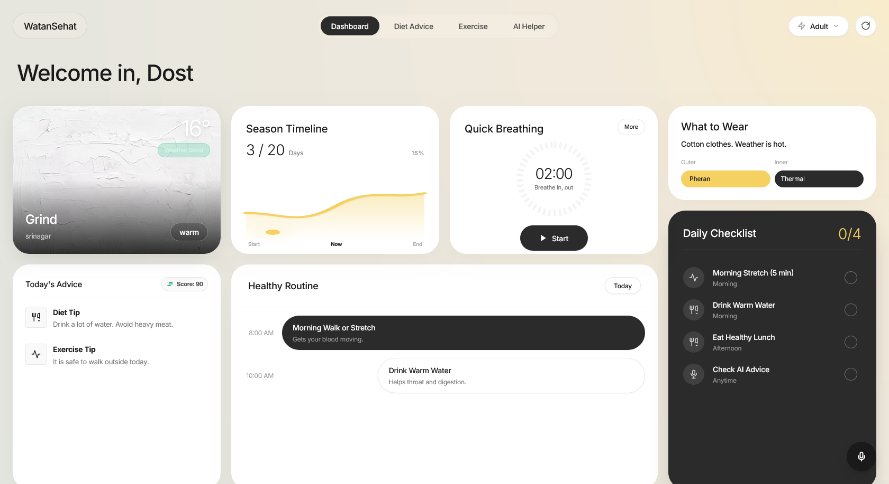

# HealthCompanion

A Kashmir-specific offline-first health companion kiosk application. Works 100% offline with AI-powered health guidance, seasonal diet recommendations, exercise planning, and voice interaction in Urdu/Kashmiri.



## Features

- **Offline-First**: All features work without internet. Complete data bundled on device.
- **Kashmir-Specific**: 8 named Kashmiri seasons, seasonal health intelligence, traditional diet guidance
- **Voice Interface**: Speak Urdu/Kashmiri → get health advice spoken back (Whisper STT + Coqui TTS)
- **Age-Adaptive**: Three modes — children (بچہ), adults (جوان), elderly (بزرگ) with tailored UI and content
- **AI-Grounded**: RAG-augmented LLM responses grounded in Kashmir health data, not hallucinations
- **Kiosk-Ready**: Fullscreen touch interface for 800×480 Raspberry Pi displays

## Tech Stack

| Layer | Technology |
|-------|-----------|
| Backend | Python 3.10+ + FastAPI + Uvicorn |
| Frontend | React 18 + Vite + Tailwind CSS |
| Voice STT | OpenAI Whisper (tiny, 39MB, Urdu-capable) |
| Voice TTS | Coqui TTS (Urdu VITS model, offline) |
| Local LLM | Ollama (qwen2.5:1.5b) |
| Cloud Fallback | Anthropic Claude API |
| RAG Retrieval | scikit-learn TF-IDF (no embeddings model) |
| Database | SQLite (zero config) |
| State | Zustand |

## Hardware Requirements

- **Display**: 800×480px touch screen (7" HDMI recommended)
- **CPU**: Raspberry Pi 5 or equivalent ARM Cortex-A76 @ 2.4GHz+
- **RAM**: 4GB minimum (8GB recommended)
- **Storage**: 32GB microSD card
- **Audio**: USB mic + speaker

## Quick Start

### Development (Windows WSL2)

```bash
# Backend
cd backend
pip install -r requirements.txt
uvicorn main:app --reload --host 0.0.0.0 --port 8000

# Frontend (new terminal)
cd frontend
npm install
npm run dev
```

Backend: http://localhost:8000  
Frontend: http://localhost:5173

### Raspberry Pi Deployment

```bash
git clone https://github.com/Burhanali2211/Health-Companion.git
cd Health-Companion
bash pi-setup/setup.sh
```

The setup script installs Ollama, pulls qwen2.5:1.5b, configures kiosk mode, and runs the app fullscreen on boot.

## API Endpoints

```
GET  /                           → Health check
GET  /api/context/{district}     → Current season + health context
GET  /api/districts              → All Kashmir districts
GET  /api/diet/{season}/{age}/{meal}        → Diet recommendations
GET  /api/exercise/{season}/{age}/{type}    → Exercise list
POST /api/companion/ask          → Health companion Q&A (rule + RAG + LLM)
POST /api/voice/stt              → Transcribe audio (Whisper)
POST /api/voice/tts              → Synthesize speech (Coqui)
GET  /api/kangri/safety          → Kangri heater safety for current season
```

## The 8 Kashmir Seasons

| Season | Urdu | Dates | Severity |
|--------|------|-------|----------|
| Chilla Kalan | چلہ کلاں | Dec 21 – Jan 29 | Extreme |
| Chilla Khurd | چلہ خرد | Jan 30 – Feb 19 | High |
| Chilla Bachha | چلہ بچہ | Feb 20 – Mar 2 | Moderate |
| Sonth | سونتھ | Mar 3 – Apr 30 | Mild |
| Wahaar | وہار | May 1 – Jun 14 | Pleasant |
| Grind | گرند | Jun 15 – Aug 31 | Warm |
| Harud | ہرد | Sep 1 – Nov 14 | Mild |
| Early Winter | ابتدائی سردی | Nov 15 – Dec 20 | Moderate |

## Core Architecture

### Companion Engine (Rule → RAG → LLM)

1. **Rule Engine** (instant, offline): Match user query against 60+ pre-vetted health rules
2. **RAG Retrieval** (offline): TF-IDF search over companion_rules.json, diet_plans.json, exercises.json, kashmir_general.json
3. **Ollama Local LLM** (offline): qwen2.5:1.5b grounded by retrieved context
4. **Gemini Fallback** (online-only): If Ollama errors, not for poor quality

All responses are grounded in actual Kashmir health data. No hallucination.

### Frontend Pages

- **Home**: Season info, age mode selector, network badge, quick actions
- **Diet**: Seasonal meal plans filtered by age, meal type
- **Exercise**: Season-locked exercises with form guidance
- **Companion**: Voice + text chat with AI health assistant
- **Buzurg**: Elderly-mode UI (large text, Koshur-first, accessibility)

## Data Files

```
backend/data/
├── seasons.json              # 8 Kashmiri seasons + districts
├── companion_rules.json      # 60+ rule-based health responses
├── diet_plans.json           # 8 seasons × 3 ages × 5 meal types
├── exercises.json            # Season-locked exercise library
├── kashmir_general.json      # General Kashmir knowledge (geography, culture)
└── kangri_safety.json        # Kangri heater safety content
```

## Development

### Key Files

**Backend**:
- `main.py` — FastAPI entry point, all endpoints
- `companion_engine.py` — Rule engine, RAG integration, LLM dispatch
- `seasonal_engine.py` — Kashmir season calendar logic
- `diet_engine.py`, `exercise_engine.py` — Content selectors
- `rag_engine.py` — TF-IDF retrieval (no embeddings)
- `voice/stt.py`, `voice/tts.py` — Whisper + Coqui

**Frontend**:
- `src/App.jsx` — Main app layout + routing
- `src/pages/` — Home, Diet, Exercise, Companion, Buzurg
- `src/hooks/` — useSeasonData, useVoice, useOnlineStatus
- `src/store/appStore.js` — Zustand global state
- `tailwind.config.js` — Watan color tokens + glassmorphism utils

### Running Tests

```bash
cd backend
python test_companion.py
```

## Environment Variables

Create `backend/.env`:
```
GEMINI_API_KEY=your_key_here
WATAN_OLLAMA_MODEL=qwen2.5:1.5b
```

(Gemini is optional; the app works fully offline via Ollama.)

## Design System

### Colors
- **Saffron** (#E8821A): Primary accent, season names
- **Chinar** (#C0392B): Alerts, warnings
- **Dal** (#2E86AB): Companion module
- **Pine** (#2D5016): Exercise module
- **Gold** (#D4AC0D): Buzurg (elderly) mode
- **Night** (#1A1A2E): App background

### Typography
- **Urdu/Koshur**: Noto Nastaliq Urdu, RTL, direction: rtl
- **Latin/Numbers**: Inter
- **Buzurg Mode**: +5px to all text sizes, +12px to touch targets

## Production Deployment

The app is designed for kiosk deployment on Raspberry Pi 5:

1. Boot with `pi-setup/setup.sh` (auto-runs on startup via systemd)
2. Chromium fullscreen, no navigation chrome
3. Offline-capable: all data bundled, no external API calls required
4. Voice hardware: USB mic + speaker (tested with Pi-compatible models)

## Contributing

This is a demonstration kiosk for investor pitches. Architecture and tech stack are fixed per CLAUDE.md specifications.

## License

Proprietary — Health Wellness Companion initiative.

## Contact

Built with Claude Code. Questions? [easyio.tech@gmail.com](mailto:easyio.tech@gmail.com)
